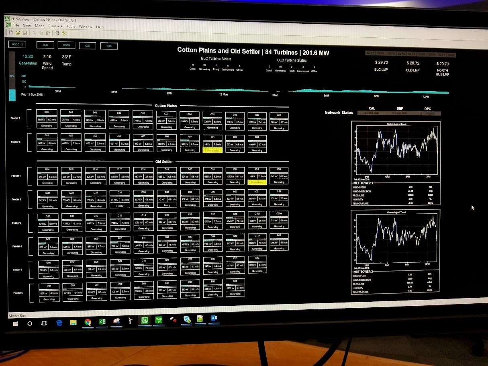

# SCADA Dashboard Sim

A VBA + Python simulation of a SCADA dashboard used in wind/solar power monitoring. This project replicates the live dashboard environment of a Remote Operations Control Center (ROCC), simulating real-time data feeds, turbine state categorization, and site-level drill-down views.

## 📁 Project Structure

```plaintext
scada-dashboard-sim/
├── data/
│   └── fake_scada_data.csv
├── excel_macro/
│   └── scada_simulation.xlsm
├── dash_app/
│   └── app.py
├── docs/
│   ├── README_template.md
│   └── screenshots/
│       ├── fleet-overview/
│       │   ├── ROCC-02.15.2019.jpg
│       │   └── dashboard_reference.jpg
│       ├── site-level/
│       │   └── BLC-OLD_Site-Level-Dashboard-02.12.2018.jpg
│       └── comparisons/     # (Optional: before/after mockups)
└── README.md
```

## 🔧 Components

- **Excel Macro Simulation**  
  VBA-powered `.xlsm` file that simulates wind farm telemetry including turbine states, generation, and wind speed. Refreshes every 30 seconds with realistic fake data.

- **Dash App**  
  A Python-based Dash web app that mimics the SCADA fleet-level and site-level dashboards, with drill-down interactivity and dynamic layout.

- **Docs and Visual References**  
  Screenshots of original dashboard designs and site layouts to guide simulation accuracy.

## 🧪 Simulated Wind Farms

The example project uses these fictional site names:

| Abbreviation | Site Name |
|--------------|------------|
| `GEN`        | Genesis    |
| `FOS`        | Foster     |
| `WHR`        | Whirl      |

These replace real wind farm identifiers to preserve anonymity while retaining structure and realism.

## 🖼️ Screenshots

### Fleet-Level Dashboard  


### Site-Level View  


---

## 🚀 Future Enhancements

- Add side-by-side comparison views under `docs/screenshots/comparisons/`
- Automate generation forecast reports using weather + turbine specs
- Export alerts and turbine states to a centralized log
- Improve Dash app styling to match historical screen formats
- Add user-selectable refresh rates (30s default)

---

## 🧠 Background

The original system this project is based on operated at a 30-second data refresh interval and was built within the eDNA View environment. While the dashboard interface was drag-and-drop based, this simulation captures the key automation and formatting logic using VBA and Python. Animated objects (e.g., circular wind speed meters) and grouped UI tiles were central to the original real-time monitoring design.

This repo aims to recreate that environment as a portfolio-grade simulation.

---

## 📬 Contact

Maintained by Nathan Miller (nmiller-codes).  
Feel free to fork, open issues, or suggest enhancements.

---

*This project is intended for educational and portfolio purposes only. No proprietary data is used.*
